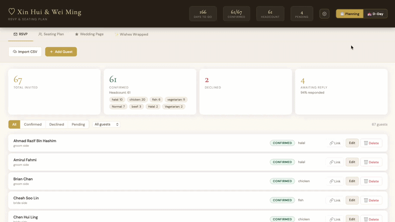

# 💍 Wedding Planner & Guest Tracker

A two-phase wedding management app — pre-wedding RSVP collection and seating plan, then wedding-day check-in, table management, and red packet (angbao) tracking. Built with React + Vite, powered by Supabase.



> The database is the trust boundary: Row Level Security locks all guest data to authenticated helpers. The public RSVP form accesses the DB only through narrow `security definer` RPC functions — the full guest list is never exposed. See [`SECURITY.md`](SECURITY.md) for the threat model.

---

## Features

### 📋 Planning Mode (pre-wedding)
- **RSVP collection** — guests go to `/rsvp`, fill in their name + choices, submit. Fuzzy name matching verifies them against your guest list without exposing it.
- **RSVP dashboard** — see confirmed / declined / pending counts, headcount (including response rate), meal breakdown; filter by status or bride/groom side; edit any RSVP field inline
- **Seating plan** — create tables with capacity limits, assign confirmed guests by dropdown or drag-and-drop, lock tables when done, export as CSV, print-ready layout
- **Draft seating suggestion** — one click groups unassigned confirmed guests by side / relationship / friend group and packs them into open tables as a starting draft to rearrange by hand — no AI involved, just deterministic clustering
- **Personalised wedding page** — publish a `/wedding/:slug` page with your love story, event schedule, and RSVP button

### 💒 D-Day Mode (wedding day)
- **Check-in** — tap to mark guests arrived, with timestamp
- **Table view** — all tables at a glance with arrival progress; tap a guest to update inline
- **Angbao tracker** — log red packets and amounts per guest, with a running total
- **PayNow ang-bao QR** — public page where guests scan a pre-filled, amount-locked PayNow QR (Singapore only)
- **VIP & bride/groom tagging** — starred VIPs; pink/blue colour coding by side
- **CSV import/export** — bulk import a guest list; export an attendance report afterwards
- **JSON backup** — one-tap lossless backup of every guest record
- **Undo** — check-ins, angbao changes, and deletes can be undone from the toast
- **Real-time sync** — devices auto-sync every 5 seconds

Switch between modes with the **📋 Planning / 💒 D-Day** toggle in the header.

---

## Screenshots

<!-- Add static screenshots here after recording. Example:


-->

---

## How the RSVP works

Share one link with all your guests — no individual links needed:

```
https://your-app.vercel.app/rsvp
```

Guests open it, fill in the form (name, attendance, meal choice, dietary needs, message), and submit. Their name is fuzzy-matched against your guest list on the server — typos and partial names still resolve correctly. If verification passes, their RSVP is saved and they receive a confirmation email with a personalised link to update their response later. The guest list is never sent to the browser.

**Updating an RSVP:** the confirmation email contains a unique `?token=` link. Clicking it reopens the form pre-filled with their previous answers. Submitting again updates their record. If a guest changes from confirmed to declined (or vice versa), you receive a notification email.

---

## Prerequisites

- [Node.js](https://nodejs.org/) v18+
- A free [Supabase](https://supabase.com) account
- A [Vercel](https://vercel.com) account to deploy

---

## Quick start

```bash
git clone https://github.com/shangweisong/wedding-tracker.git
cd wedding-tracker
npm install
cp .env.example .env   # fill in VITE_SUPABASE_URL + VITE_SUPABASE_ANON_KEY
npm run dev
```

Open `http://localhost:5173` for the admin. Open `http://localhost:5173/rsvp` to see the RSVP form.

For the full setup — Supabase migrations, email automation, Vercel deployment, and CSV import — see the **[User Guide](docs/USER_GUIDE.md)**.

---

## Local dev commands

```bash
npm run dev       # Vite dev server
npm test          # vitest unit tests
npm run lint      # ESLint
npm run build     # production build → dist/
npm run preview   # serve dist/ locally
vercel dev        # test serverless functions locally (requires Vercel CLI + .env)
```
